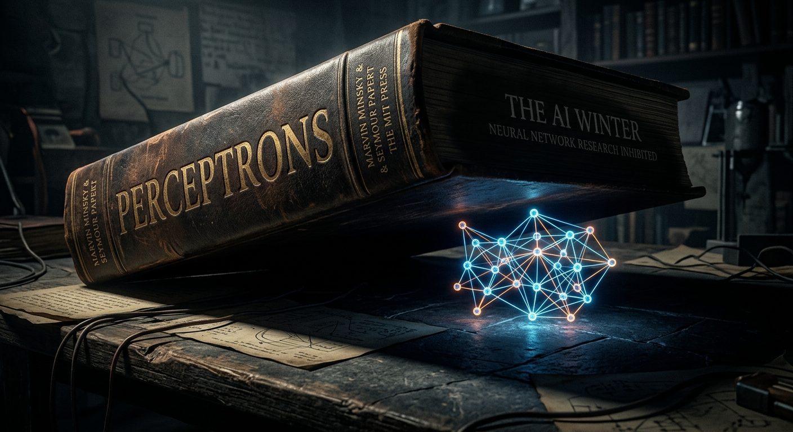
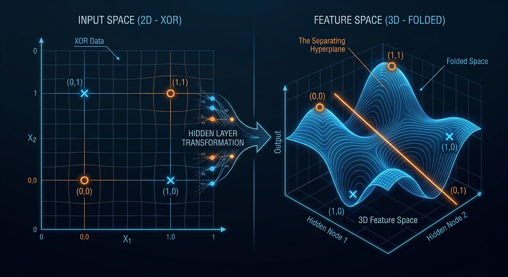
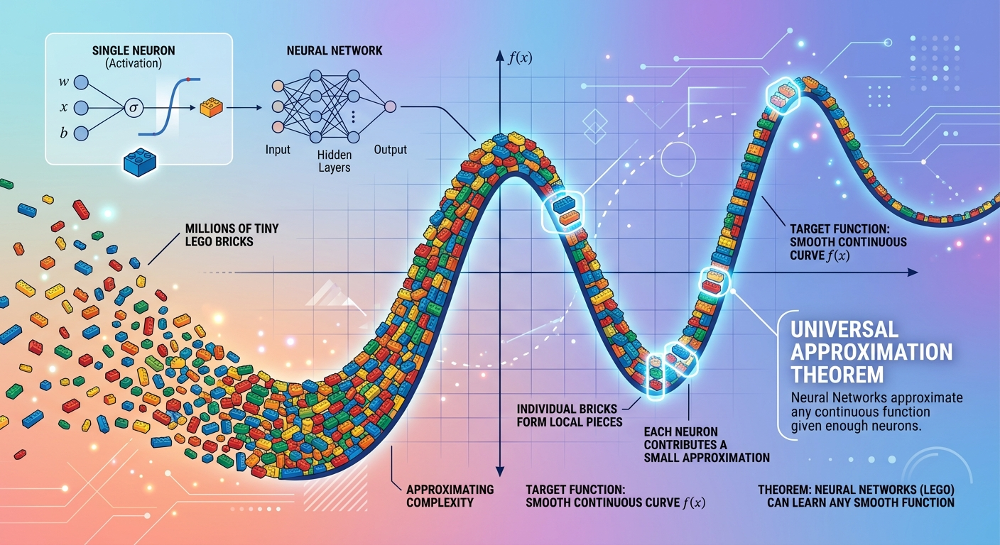
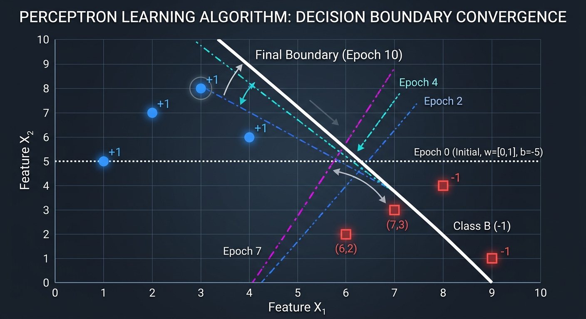
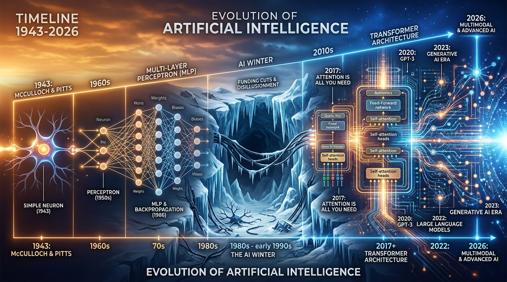

> 从生物神经元到感知机，从异或危机到万能近似——神经网络的第一性原理。

## 第一夜：一个神经元，一条线

> **引言：** 1957 年，《纽约时报》刊出一则惊人的消息：海军资助的一台机器，"未来将能行走、说话、书写、自我复制，甚至意识到自己的存在"。这台机器叫 **Mark I 感知机**（Perceptron），它的发明者 Frank Rosenblatt 当时只有 29 岁。
>
> 但 12 年后，两位 MIT 教授用一本小书几乎杀死了整个领域。这是怎么回事？让我们从最基本的问题开始——一个神经元到底能做什么？

**少年：** 我一直听说"神经网络模仿大脑"。但大脑有 860 亿个神经元，AI 的"神经元"真的跟大脑有关系吗？还是只是借了个名字？

**导师：** 好问题。说实话——**更像是借了个名字**。但这个类比在历史上确实启发了整个领域的诞生，所以值得了解它"像在哪里，又不像在哪里"。

先看真正的生物神经元。它有四个关键结构：

- **树突（Dendrites）**：像章鱼的触手，从别的神经元那里接收电信号
- **细胞体（Cell Body）**：把所有输入信号汇总——如果总信号超过某个阈值……
- **轴突（Axon）**：就像一根长电线，把"激活"信号传出去
- **突触（Synapse）**：连接点。关键在于——每个突触的传递效率不一样。有的连接"强"，有的"弱"

1943 年，McCulloch 和 Pitts 就把这个过程简化成了数学：

$$
y = f\left(\sum_{i=1}^{n} w_i x_i + b\right)
$$

- 输入 $x_i$ → 对应树突接收的信号
- 权重 $w_i$ → 对应突触的强度
- 求和 + 偏置 → 对应细胞体的汇总
- 激活函数 $f$ → 对应"超过阈值就激活"

**但这里有一个关键的不像：** 真正的大脑用的是时序脉冲（spike timing），信号的"时间"非常重要。人工神经元完全忽略了时间，只做一次加权求和。所以严格来说，人工神经元是对生物神经元一个**非常粗暴的简化**。

**少年：** 等等，所以一个人工神经元本质上就是……加权求和然后过一个函数？这也太简单了吧？它能做什么有用的事吗？

**导师：** 你别小看它。我们来手算一个。

假设我要做一个 **AND 门**（两个输入都是 1 才输出 1）。用阶跃函数：大于等于 0 输出 1，否则输出 0。

设权重 $w_1 = 0.5, w_2 = 0.5$，偏置 $b = -0.8$：

| $x_1$ | $x_2$ | $0.5x_1 + 0.5x_2 - 0.8$ | 输出（step） |
|---|---|---|---|
| 0 | 0 | -0.8 | 0 ✅ |
| 1 | 0 | -0.3 | 0 ✅ |
| 0 | 1 | -0.3 | 0 ✅ |
| 1 | 1 | 0.2 | 1 ✅ |

完美！一个神经元就实现了 AND。

再试 **OR 门**。改一下偏置：$w_1 = 0.5, w_2 = 0.5, b = -0.3$：

| $x_1$ | $x_2$ | $0.5x_1 + 0.5x_2 - 0.3$ | 输出（step） |
|---|---|---|---|
| 0 | 0 | -0.3 | 0 ✅ |
| 1 | 0 | 0.2 | 1 ✅ |
| 0 | 1 | 0.2 | 1 ✅ |
| 1 | 1 | 0.7 | 1 ✅ |

也行！

**少年：** 哦，有意思。那 **NOT 门** 呢？一个输入取反。

**导师：** 更简单：$w_1 = -1, b = 0.5$

| $x_1$ | $-1 \times x_1 + 0.5$ | 输出 |
|---|---|---|
| 0 | 0.5 | 1 ✅ |
| 1 | -0.5 | 0 ✅ |

所以一个神经元可以实现 AND、OR、NOT。你可能知道，这三个门组合起来可以表达任何逻辑运算——这就是为什么 Rosenblatt 在 1957 年发明感知机（Perceptron）的时候，大家这么兴奋。如果一个神经元就能做逻辑门，那一堆神经元岂不是什么都能算？

**少年：** 等一下。AND、OR、NOT 都行了，那 **XOR** 呢？两个输入不同时输出 1，相同时输出 0。

**导师：** 你问到了**整个领域的痛点**。试试看——你能找到一组 $w_1, w_2, b$ 让它工作吗？

🔑 **关键洞察：一个神经元本质上是在画一条"线"（更高维度是超平面）。输入空间被这条线分成两半——一半输出 1，一半输出 0。AND 和 OR 的四个点恰好可以被一条线分开，但 XOR 的四个点不行。** 这就是所谓的"线性不可分"。

---

## 第二夜：一本书杀死一个领域

> **引言：** 上一夜我们发现，单个感知机虽然能实现 AND 和 OR，却搞不定 XOR——一个看起来很简单的逻辑。这不只是一个数学问题，它引发了 AI 历史上最著名的一场"谋杀案"。1969 年，两位 MIT 大佬出版了一本书，直接把神经网络打入冷宫十多年。

**少年：** 你说的是 Minsky 和 Papert 的《Perceptrons》？他们到底证明了什么？就因为 XOR 做不了？

**导师：** 不只是 XOR。Minsky 和 Papert 做的事情更系统、更致命。

他们证明了：单层感知机**在原理上**无法解决一整类问题——所有"线性不可分"的问题。XOR 只是最简单的例子。更实际的例子：判断一个图形是否"连通"（一笔画连在一起），单层感知机也做不到。

他们的论证很优雅。在二维平面上画出 XOR 的四个点：

```text
(0,0)→0    (1,0)→1
(0,1)→1    (1,1)→0
```

感知机的决策边界是一条直线 $w_1 x_1 + w_2 x_2 + b = 0$。你在纸上画画看——无论你怎么画这条线，都不可能把 (0,1) 和 (1,0) 放在一边，(0,0) 和 (1,1) 放在另一边。

因为 (0,0) 和 (1,1) 在对角线的两端——它们之间隔着需要输出 1 的点。

**少年：** 好，线性不可分我理解了。但这不是早就知道的事吗？为什么这本书的杀伤力这么大？

**导师：** 三个原因：

**第一，权威碾压。** Minsky 是 MIT AI 实验室的创始人，当时 AI 界的教父级人物。他说"这条路走不通"，几乎所有的资金机构都听了。

**第二，当时没人能证明多层网络可以训练。** Minsky 在书里其实提到了："多层感知机也许能解决这个问题"——但他紧接着说，"目前没有已知的训练方法"。1969 年，反向传播算法还没被发明（或者说没被广泛认知）。所以大家觉得：一层的已经证明不行了，多层的又不知道怎么训练，那这条路确实死了。

**第三，时代背景。** 当时符号 AI（专家系统、逻辑推理）正如日中天。主流 AI 界本来就看不上"连接主义"（神经网络），这本书给了他们完美的弹药。

结果就是：**1969-1986 年，神经网络研究的资金几乎完全断裂。** 这就是第一次"AI 寒冬"。

**少年：** 十七年！那后来是谁"复活"了它？

**导师：** 坚持在冬天里做研究的人。最关键的突破来自 1986 年——Rumelhart、Hinton 和 Williams 发表了著名的反向传播论文。但那是下一篇的故事。今天我们先解决一个更基本的问题：**XOR 到底怎么解？**

🔑 **关键洞察：Minsky-Papert 的批判在技术上完全正确——单层感知机确实有本质局限。但他们的结论被过度推广了。一本正确的技术著作，因为权威效应和时代背景，导致了整个领域 17 年的停滞。科学史上，"正确的批评"有时比"错误的鼓励"更致命。**



---

## 第三夜：加一层，世界就不一样了

> **引言：** 单层感知机画不了 XOR 的决策边界——这是数学事实。但如果我们再加一层神经元呢？这就是多层感知机（MLP）的核心思想。关键在于：多一层意味着多一次"空间变换"，原本纠缠在一起的数据点，可以被"掰开"。

**少年：** 好，你说加一层就行。那具体怎么加？能手算给我看吗？

**导师：** 当然。这是我最喜欢的手算之一。

XOR 可以拆成已知的逻辑：

$$
\text{XOR}(x_1, x_2) = \text{AND}(\text{OR}(x_1, x_2), \text{NAND}(x_1, x_2))
$$

翻译成人话：$x_1$ 和 $x_2$ 至少有一个是 1（OR），**并且**它们不全是 1（NAND）。

所以我们需要三个神经元：

- 隐藏层神经元 $h_1$：实现 OR → $w = [0.5, 0.5], b = -0.3$
- 隐藏层神经元 $h_2$：实现 NAND → $w = [-0.5, -0.5], b = 0.8$
- 输出神经元 $y$：实现 AND → 对 $h_1, h_2$ 做 AND → $w = [0.5, 0.5], b = -0.8$

走一遍所有输入：

**输入 (0, 0)：**

- $h_1 = \text{step}(0.5 \times 0 + 0.5 \times 0 - 0.3) = \text{step}(-0.3) = 0$
- $h_2 = \text{step}(-0.5 \times 0 - 0.5 \times 0 + 0.8) = \text{step}(0.8) = 1$
- $y = \text{step}(0.5 \times 0 + 0.5 \times 1 - 0.8) = \text{step}(-0.3) = 0$ ✅

**输入 (1, 0)：**

- $h_1 = \text{step}(0.5 - 0.3) = \text{step}(0.2) = 1$
- $h_2 = \text{step}(-0.5 + 0.8) = \text{step}(0.3) = 1$
- $y = \text{step}(0.5 + 0.5 - 0.8) = \text{step}(0.2) = 1$ ✅

**输入 (0, 1)：**

- $h_1 = \text{step}(0.5 - 0.3) = \text{step}(0.2) = 1$
- $h_2 = \text{step}(-0.5 + 0.8) = \text{step}(0.3) = 1$
- $y = \text{step}(0.5 + 0.5 - 0.8) = \text{step}(0.2) = 1$ ✅

**输入 (1, 1)：**

- $h_1 = \text{step}(0.5 + 0.5 - 0.3) = \text{step}(0.7) = 1$
- $h_2 = \text{step}(-0.5 - 0.5 + 0.8) = \text{step}(-0.2) = 0$
- $y = \text{step}(0.5 + 0 - 0.8) = \text{step}(-0.3) = 0$ ✅

**XOR 解决了！**

**少年：** 哇，确实算出来了。但等等——这里有个我不理解的事。你手动设定了所有的权重。实际用的时候，怎么让机器自己找到这些权重？

**导师：** 一针见血的问题。这正是 Minsky 在 1969 年指出的核心难题——"多层的也许能解决问题，但我们不知道怎么训练它"。

答案就是 **反向传播（Backpropagation）**。1986 年，Rumelhart、Hinton 和 Williams 在 Nature 上发表的论文系统化了这个算法。核心思想：

1. 先用当前权重算一遍结果（前向传播）
2. 跟正确答案对比，算出"错了多少"（损失）
3. 从输出层往输入层，逐层算出每个权重对误差的"贡献"（链式法则）
4. 按"贡献"调整权重——贡献大的多调，贡献小的少调

但具体怎么反向传播——那是系列的第二篇。

**少年：** 好，回到今天的问题。你刚才说隐藏层让 XOR 变得可解。但我想从直觉上理解——加一层到底做了什么？为什么一层不行两层就行？

**导师：** 这个问题问得太好了。答案是三个字：**空间折叠。**

想象你面前有一张纸，上面有四个点（代表 XOR 的四个输入），红蓝交替排列。你没法用一刀切把红的和蓝的分开——这就是"线性不可分"。

但如果你能**把纸折起来**呢？折一下之后，原本在对角线两端的点可能被折到了同一侧！

这就是隐藏层干的事。每个隐藏层神经元做了一次线性变换 + 非线性激活——相当于把输入空间"折了一下"。

具体到 XOR：

- 原始空间：四个点 (0,0), (0,1), (1,0), (1,1) 在二维平面上
- 经过隐藏层变换后，它们被映射到一个**新的空间**：$(h_1, h_2)$ = (0,1), (1,1), (1,1), (1,0)

看到了吗？(0,1) 和 (1,0) 在新空间里变成了同一个点 (1,1)！原本分不开的，现在用一条线就能切了。

**少年：** 原来如此！所以每加一层，就多一次"折叠"的机会。层越多，能折出越复杂的形状？

**导师：** 完全正确。而且有一个重要的定理保证了这一点——**万能近似定理（Universal Approximation Theorem）**。

🔑 **关键洞察：隐藏层的本质是空间变换——把线性不可分的数据"折叠"到一个新空间，使其变得线性可分。每多一层，折叠能力就更强。这就是"深度"的力量。**



---

## 第四夜：万能近似——理论的"空头支票"

> **引言：** 上一夜我们看到，加一层隐藏层就解决了 XOR。那自然要问：如果我加很多层、很多神经元，是不是什么函数都能拟合？1989 年，数学家 George Cybenko 给出了答案——但这个答案既令人兴奋，又暗藏陷阱。

**少年：** 万能近似定理具体说了什么？

**导师：** 它说的是：**一个只有一层隐藏层的前馈神经网络，只要隐藏层的神经元足够多，就可以以任意精度逼近任何连续函数。**

注意几个关键词：

- "一层"——不需要很深，一层就够
- "足够多"——理论上可能需要指数级多的神经元
- "任意精度"——想多近就多近
- "连续函数"——不连续的不保证

**少年：** 等等，如果一层就够了，那为什么还要搞深度学习？搞很多层干嘛？

**导师：** 这正是这个定理最容易被误解的地方！

打个比方：我告诉你"用乐高积木可以拼出蒙娜丽莎"——这在理论上是对的。但你需要多少块积木？几百万块。而且你没有说明书告诉你怎么拼。

万能近似定理就是这样的"空头支票"：

- ✅ **存在性**：保证一定存在一组权重能拟合目标函数
- ❌ **不告诉你怎么找**：梯度下降不一定能找到那组权重
- ❌ **不告诉你需要多少神经元**：可能需要天文数字
- ❌ **不告诉你效率**：也许很深的网络只需要少量神经元就够了

**少年：** 所以"一层很宽"和"很多层但每层较窄"，哪个更好？

**导师：** 这是深度学习最核心的洞察之一。答案是：**深比宽高效得多。**

直觉上：深度网络可以"分层抽象"。

拿人脸识别举例：

- 第一层：检测边缘（横线、竖线、斜线）
- 第二层：组合边缘成局部特征（眼睛、鼻子、嘴巴）
- 第三层：组合局部特征成全局结构（一张脸）

每层复用前一层的结果。如果你只用一层，就需要一个神经元直接从像素跳到"这是一张脸"——它需要学会所有中间步骤，参数量爆炸。

数学上也有结果：某些函数用深度为 $k$ 的网络只需要多项式个神经元，但用深度为 $k-1$ 的网络就需要指数级。这就是所谓的**深度分离定理（Depth Separation）**。

**少年：** 我有点理解了。万能近似说"理论上可以"，深度网络说"实践中这样更高效"。那现代的大语言模型（比如 GPT），里面还有 MLP 吗？

**导师：** 不仅有——**MLP 是 Transformer 里的核心组件之一！**

Transformer 的每一层有两个子模块：

1. **Multi-Head Attention**：负责"token 之间的交流"
2. **FFN（Feed-Forward Network）**：就是一个两层的 MLP！

$$
\text{FFN}(x) = \text{GELU}(xW_1 + b_1)W_2 + b_2
$$

这个 FFN/MLP 干什么呢？最近的研究表明，它像一个巨大的"知识记忆库"——把 Attention 收集来的信息做进一步处理和存储。

所以你看，从 1943 年 McCulloch-Pitts 的单个神经元，到 2024 年 GPT-4 里的万亿参数，MLP 这个基本结构一直在——只是被套上了越来越精巧的"外壳"。

**少年：** 我突然觉得……从感知机到 GPT，这条线比我想象的连贯多了。

🔑 **关键洞察：万能近似定理保证了"能力上限"，但深度网络的真正价值在于"效率"——分层抽象让网络用合理的参数量解决复杂问题。MLP 从 1943 年一直活到了 Transformer 时代，是深度学习最持久的基本组件。**



---

## 第五夜：感知机学习算法——机器怎么"自学"

> **引言：** 我们手算了 AND、OR、XOR 的权重，但那都是人为设定的。Rosenblatt 真正让人兴奋的贡献不是感知机本身，而是它的**学习算法**——机器能自己从数据中找到正确的权重。这是机器学习最原始的形态。

**少年：** 学习算法？是说机器一开始不知道正确的权重，然后看了数据之后自己调整？

**导师：** 没错。而且感知机学习算法优雅得令人惊叹，只有三行：

```text
初始化权重 w 为随机值
对于每个训练样本 (x, y_true):
    y_pred = step(w · x + b)
    如果 y_pred ≠ y_true:
        w = w + (y_true - y_pred) × x
        b = b + (y_true - y_pred)
```

翻译成人话：

- 先随机猜一组权重
- 看一个样本，算出预测值
- 如果预测对了——什么都不做
- 如果预测错了——朝"正确方向"调整权重

让我手算一轮。假设要学 AND 门，初始权重 $w_1 = 0, w_2 = 0, b = 0$：

**第 1 步：** 输入 $(1, 1)$，真实标签 1

- 预测：$\text{step}(0 + 0 + 0) = \text{step}(0) = 1$（假设 step(0) = 1）
- 正确！不调整。

**第 2 步：** 输入 $(1, 0)$，真实标签 0

- 预测：$\text{step}(0 + 0 + 0) = 1$
- 错了！调整：$w_1 = 0 + (0-1) \times 1 = -1$，$w_2 = 0 + (0-1) \times 0 = 0$，$b = 0 + (0-1) = -1$

**第 3 步：** 输入 $(0, 1)$，真实标签 0

- 预测：$\text{step}(-1 \times 0 + 0 \times 1 + (-1)) = \text{step}(-1) = 0$
- 正确！

**第 4 步：** 输入 $(0, 0)$，真实标签 0

- 预测：$\text{step}(0 + 0 - 1) = 0$
- 正确！

继续多轮迭代，权重会逐渐收敛到正确值。

**少年：** 这……也太简单了吧？就这三行代码？它凭什么能收敛？

**导师：** 你问了一个深刻的问题。答案是：**感知机收敛定理**（Perceptron Convergence Theorem）。

Rosenblatt 在 1962 年证明了：如果训练数据是线性可分的，感知机学习算法**保证在有限步内收敛**到一个正确解。

这个证明的核心直觉：

- 每次犯错调整后，权重向量和"理想权重"的夹角会减小
- 同时权重的模长增长受限
- 所以经过有限步，权重必然足够接近理想值

但注意那个前提条件——**"如果线性可分"**。对于 XOR 这样线性不可分的问题，算法会永远震荡，找不到解。

**少年：** 所以 Minsky 的批评归根结底是对的——不是算法不好，是**单层感知机能力有限**？

**导师：** 完全正确。Minsky 批评的核心就是：你的学习算法只能用于单层，而单层的能力有天花板。当时多层的训练方法（反向传播）还没普及，所以整个路线看起来死了。

但 Rosenblatt 的贡献是永恒的：他第一次证明了**机器可以从数据中学习**——这个思想是整个机器学习的根基。

🔑 **关键洞察：感知机学习算法是人类历史上第一个"机器自动从数据中学习参数"的算法。它的收敛定理在线性可分条件下是铁打的数学保证。但它的局限（只适用于单层/线性可分）也是铁打的。突破这个局限，需要等到反向传播的诞生。**



---

## 第六夜：从 1943 到 2026——一条线串起来

> **引言：** 五夜的旅程，我们从生物神经元走到了万能近似定理。现在是时候把整条时间线串起来，看看这个故事的全貌：80 多年里，人类是怎样一步步从"一个神经元"走到"万亿参数模型"的。

**少年：** 让我试着总结一下整条线索：

1943 年，McCulloch 和 Pitts 提出了人工神经元的数学模型——加权求和 + 阈值函数。这是"起点"。

1949 年，Hebb 提出了学习规则——"一起激活的神经元连接变强"。这给了"怎么学"的最初灵感。

1957 年，Rosenblatt 发明感知机，第一次实现了"机器从数据中自动学习权重"。《纽约时报》疯狂报道，大家以为 AI 要来了。

1969 年，Minsky 和 Papert 出了《Perceptrons》，证明单层感知机不能解 XOR，资金断裂，AI 寒冬。

1986 年，Rumelhart、Hinton、Williams 发表反向传播，多层网络终于可以训练了。但当时计算力不够，效果有限。

2006 年，Hinton 提出深度信念网络（DBN），重新点燃了深度学习的热情——用逐层预训练解决了深层网络难训练的问题。

2012 年，AlexNet 在 ImageNet 上碾压传统方法，深度学习正式爆发。

2017 年，Transformer（"Attention is All You Need"）横空出世。

2022-2026 年，GPT-4、Claude、Gemini……大语言模型时代。

而贯穿这条线的最基本组件——**MLP**，从 1943 年一直活到了 2026 年。

**导师：** 完美的总结。我只补充一个点：在这条 80 年的线上，有三次"低谷"和三次"复兴"：

| 时期 | 事件 | 教训 |
|---|---|---|
| 1969-1986 | 第一次 AI 寒冬（Minsky 批判） | 单层感知机有本质局限 |
| 1995-2006 | SVM 和核方法压过神经网络 | 数据和算力不够时，浅层方法更实用 |
| 2012 至今 | 深度学习爆发 | 大数据 + GPU + 算法三者缺一不可 |

每一次"死亡"都是因为当时的技术条件不够，而不是因为方向错了。坚持在冬天里做研究的人——Hinton、LeCun、Bengio——后来被称为"深度学习三巨头"，获得了 2018 年图灵奖。

**少年：** 所以一个神经元能做什么？答案是：它**本身**只能画一条线。但足够多的神经元、足够多的层，加上一个好的学习算法，就可以逼近任何函数——从识别猫到写诗。

**导师：** 一个优雅的总结。记住今天的核心线索：

🗺️ **全文知识地图：**

```text
生物神经元 → 人工神经元 (McCulloch-Pitts, 1943)
     ↓
感知机 (Rosenblatt, 1957) → 能做 AND/OR/NOT
     ↓
XOR 问题 → 线性不可分 → Minsky 批判 (1969) → AI 寒冬
     ↓
多层感知机 (MLP) → 空间折叠 → XOR 解决
     ↓
万能近似定理 (Cybenko, 1989) → "理论上什么都能拟合"
     ↓                          但"深度比宽度高效"
感知机学习算法 → 收敛定理
     ↓           (线性可分保证收敛)
反向传播 (1986) → 多层网络终于可以训练了
     ↓
深度学习爆发 (2012-) → Transformer → GPT
     ↓
MLP 仍然是 Transformer FFN 的核心组件 (2026)
```

🔑 **终极洞察：神经网络的故事不是一条直线上升的曲线，而是"突破→质疑→沉寂→再突破"的螺旋。每一次质疑都让下一次突破更加坚实。**



---

## 推荐资料

### 必读论文

- Rosenblatt, F. (1958). "The Perceptron: A Probabilistic Model for Information Storage and Organization in the Brain." *Psychological Review* ⭐⭐⭐⭐⭐ — 感知机原始论文，AI 的源头之一
- Minsky, M. & Papert, S. (1969). *Perceptrons: An Introduction to Computational Geometry* ⭐⭐⭐⭐ — 那本"杀死"神经网络的书，但技术上非常精彩
- Rumelhart, D., Hinton, G. & Williams, R. (1986). "Learning representations by back-propagating errors." *Nature* ⭐⭐⭐⭐⭐ — 反向传播论文，复兴的号角
- Cybenko, G. (1989). "Approximation by superpositions of a sigmoidal function." *Mathematics of Control, Signals and Systems* ⭐⭐⭐⭐ — 万能近似定理原始论文

### 推荐书籍

- Michael Nielsen《Neural Networks and Deep Learning》第 1-2 章 — 免费在线教材，从第一原理推导感知机，手算练习极佳：[neuralnetworksanddeeplearning.com](http://neuralnetworksanddeeplearning.com/)
- Ian Goodfellow 等《Deep Learning》第 6 章 — 深度学习"圣经"中关于前馈网络的部分

### 视频与代码

- 3Blue1Brown: "But what is a neural network?" 系列 — 可视化做得登峰造极，强烈推荐入门
- Andrej Karpathy: "The spelled-out intro to neural networks and backpropagation" — 从零手写神经网络，边写代码边解释
- [karpathy/micrograd](https://github.com/karpathy/micrograd) — 不到 100 行 Python 实现完整的自动求导引擎 + 神经网络，适合手动跑一遍理解反向传播
