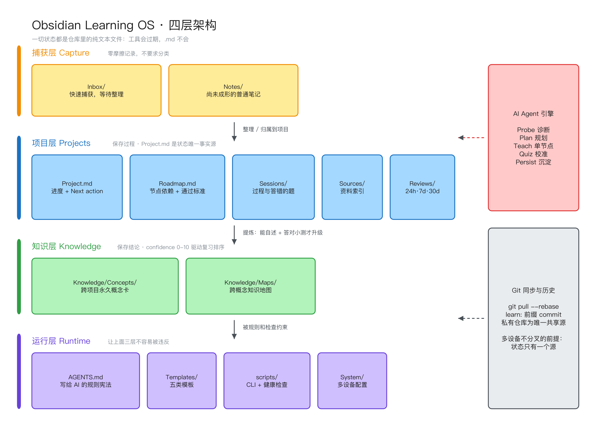
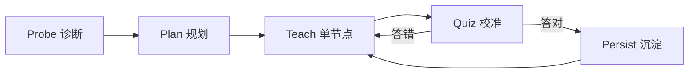

前三篇讲了这套系统为什么成立、怎么装起来、多设备怎么同步。这一篇只回答一个问题：

> 如果你要自己从零搭一套，**必须保留哪些结构，哪些可以随便改**？

我把它拆成四层结构和五条约束。四层是骨架，五条约束是真正让它不塌的东西——大多数人搭失败，不是文件夹分错了，是约束没立住。

---



> 图源为 Excalidraw，可编辑源文件在 Vault 的 `Knowledge/Maps/` 下。

## 一句话定位

```text
Obsidian  = 阅读、双链和可视化界面
Markdown  = 长期可迁移的数据协议
AI Agent  = 诊断、教学、出题、沉淀的引擎
Git       = 版本历史与多设备同步
```

四个部件里没有一个是不可替换的。Obsidian 可以换成任何 Markdown 编辑器，Agent 可以换成任何能读写本地文件的 CLI。真正不可替换的是它们之间的**协议**：一切状态都是仓库里的纯文本文件。

这条决定了系统的寿命。工具会过期，`.md` 不会。

---

## 第一层：捕获层（Inbox）

```text
Inbox/          快速捕获，等待整理
Notes/          尚未形成永久概念的普通笔记
```

捕获层只有一个职责：**让"记下来"这个动作零摩擦**。

它不要求你分类，不要求你写全，也不要求你当场决定这条信息属于哪个项目。想到什么、看到什么，先扔进 Inbox。整理是另一个时间段的事。

多数笔记系统死在这里——一开始就要求分类，于是你懒得记，于是系统空转。

## 第二层：项目层（Projects）

这是整个系统的重心。每个学习主题是一个独立目录，结构强制统一：

```text
Projects/<project-id>/
├── Project.md      项目状态的唯一事实源
├── Roadmap.md      学习节点依赖与通过标准
├── Sessions/       学习过程（探索、错误、纠正）
├── Sources/        资料索引与来源笔记
└── Reviews/        项目专项复习队列
```

五个文件的职责必须分得干净：

| 文件 | 存什么 | 不存什么 |
|---|---|---|
| `Project.md` | 当前节点、进度、Known/Shaky/Missing | 教学内容 |
| `Roadmap.md` | 节点依赖图、每个节点的通过标准 | 进度 |
| `Sessions/` | 完整过程，包括答错的题 | 结论 |
| `Sources/` | 外部资料的索引和摘要 | 原始资料本体 |
| `Reviews/` | 24h / 7d / 30d 主动回忆任务 | 新知识 |

其中 `Project.md` 是**唯一事实源**。任何时候想知道"这个主题我学到哪了"，只看这一个文件。它长这样：

```markdown
## Current node

- Stage: Teach
- 当前里程碑：**W1 · 核心循环**
- 已有代码：`my-agent/src/miniagent/loop.py`（23 行）
- Next action：补完 W1 验收——三种 stop_reason 各有测试覆盖
```

`Next action` 这一行是整个系统里最有价值的一行字。它让"下次继续"不需要重新读一遍历史。

`Roadmap.md` 则用 Mermaid 画依赖，每个节点必须写清通过标准：

```text
### W2. 工具系统

- [ ] `tools/registry.py` 装饰器注册
- [ ] 四个内置工具：read_file / write_file / bash / web_search
- **通过标准**：模型能发起调用、拿到结果并继续；
  工具报错以 tool_result 回传而不是崩溃。
```

没有通过标准的节点等于没有节点。"学会工具系统"不可验证，"工具报错以 tool_result 回传而不是崩溃"可验证。

## 第三层：知识层（Knowledge）

```text
Knowledge/Concepts/     跨项目的永久概念
Knowledge/Maps/         跨概念的知识地图
```

项目层保存**过程**，知识层保存**稳定知识**。这条分界线是这套系统和普通笔记库最大的差别。

一篇概念卡的固定骨架：

```markdown
---
type: concept
domain: "Agent Framework"
confidence: 5
last_reviewed:
source: "learn-claude-code/s01, hermes-lab/M03"
ref_links:
  - https://arxiv.org/abs/2210.03629
---

## One sentence      能不能一句话说清
## Intuition         直觉图示
## Formal definition 严谨定义/代码
## Worked example    可跑的例子
## Pitfall           踩过的坑
```

`confidence` 字段（0–10）是这层的核心机制。**新写的概念卡 confidence 必须保守**，通过复习和实际使用才往上加。Dashboard 靠它排序：

```dataview
TABLE domain, confidence, last_reviewed
FROM "Knowledge/Concepts"
WHERE type = "concept"
SORT confidence ASC, last_reviewed ASC
```

于是打开首页，最不稳的知识自动排在最上面。这比任何"复习提醒插件"都可靠，因为它是从你自己的诚实评分里长出来的。

## 第四层：运行层（scripts / Templates / AGENTS.md）

```text
Templates/      项目、会话、概念、资料、复习模板
Prompts/        AI 教学提示词
scripts/        CLI 与健康检查
AGENTS.md       AI 协作规则
System/         新设备安装与模型配置
```

`AGENTS.md` 是这层里最容易被低估的文件。它是写给 AI 看的宪法——定义目录职责、教学循环、文件操作安全边界。有了它，任何一个能读本地文件的 Agent 进到这个目录，行为都一致；换模型不用重新调教。

`scripts/vault_health.py` 是另一半保险，它检查的东西全是"人会犯而且很难自己发现"的错：

```text
missing-project-file     项目缺 Project.md
invalid-frontmatter      frontmatter 没闭合
broken-wikilink          双链指向不存在的文件
conflict-marker          文件里残留 Git 冲突标记
literal-secret           疑似把 API Key 写进了仓库
git-unmerged             有未解决的合并冲突
```

结构化系统的风险是**悄悄腐烂**：一个断链、一段没闭合的 frontmatter，半年后 Dataview 查询默默少一行，你还以为自己没学过。健康检查把腐烂变成报错。

---

## 五条设计约束

结构可以照抄，约束必须理解。以下五条是我踩过之后才立住的。

### 1. 项目存过程，Knowledge 存结论

不把整段 AI 回答直接当成永久知识。AI 讲得再好，那也只是过程，先进 `Sessions/`。只有当你能用自己的话重写、并且答对了小测，它才有资格变成 `Knowledge/Concepts/` 里的一张卡。

违反这条的后果：知识库看起来很丰满，实际上是一堆你没读过的 AI 输出。

### 2. 先查再写

创建项目、概念、资料之前先搜一遍是否已存在。重复概念卡是知识库的癌症——两张卡讲同一件事，各自演化，最后哪张都不敢信。

### 3. 先测再教

新主题一律走 **Probe → Plan → Teach → Quiz → Persist**：



先问 3～5 个诊断题，把已知分成 Known / Shaky / Missing，再决定从哪开始讲。跳过 Probe 的代价是：AI 花 20 分钟教你已经会的东西，而你真正缺的那块它根本没发现。

### 4. 一次一个节点

每次只教一个节点，讲完必测。没通过就换角度重讲，不推进。

这条最反直觉，也最重要。AI 天然倾向于一次给你一整篇长文，因为那样"信息量大"。但学习的瓶颈从来不是信息量，是校准频率。

### 5. 状态只有一个源

`Project.md` 是项目进度的唯一事实源，其他地方一律不重复写进度。多设备场景下，两个地方写进度就等于两个地方会分叉。

---

## 这个框架不做什么

一开始我想要的东西多得多：自动同步、移动端捕获、向量检索、RAG、多 Agent 协作、定时复习推送。

现在一个都没有。原因是 MVP 阶段每加一个组件，就多一个"系统坏了但你不知道"的位置。当前只依赖四样东西：文件系统、Git、Markdown、一个能读写本地文件的 Agent。全部可以在断网的飞机上工作，全部可以在十年后用记事本打开。

等到日常使用足够稳定，再逐个考虑加。顺序是：先让系统跑不坏，再让它跑得快。

---

## 最小可用版本

如果你现在就想搭，不需要复制我这套完整结构。三步就有可用版本：

```bash
mkdir -p learning-os/{Inbox,Projects,Knowledge/Concepts,Templates}
cd learning-os && git init
```

然后写一个 `AGENTS.md`，内容只需要三段：目录职责、Probe→Plan→Teach→Quiz→Persist 循环、以及"项目存过程，Knowledge 存结论"。

剩下的——Dataview 首页、健康检查脚本、多设备规则、CLI——都是等你真的用起来、真的被某个问题咬到之后再加。我这套里的每一个脚本，都是先被咬了一次才写的。

[下一篇](../learning-os-handbook/)讲具体怎么用：一次完整的学习会话从哪句话开始，到哪个文件结束。
