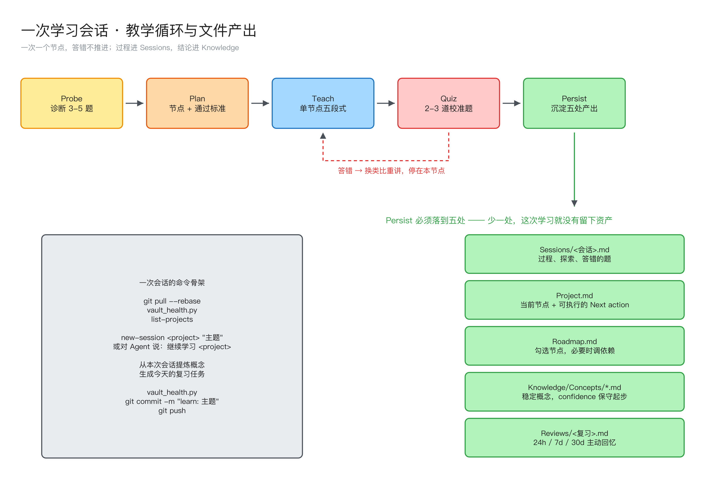

[上一篇](../learning-os-architecture/)拆了框架结构，这一篇只做一件事：**跟着走一遍**。

从我坐下来敲第一条命令，到最后 `git push`，中间发生了什么、产生了哪些文件、每个文件该写什么。四十分钟一轮，这是我实际的用法。

---



> 图源为 Excalidraw，可编辑源文件在 Vault 的 `Knowledge/Maps/` 下。

## 0. 开场：三条命令

```bash
git pull --rebase
python3 scripts/learning.py list-projects
python3 scripts/vault_health.py
```

第一条保证不和另一台设备打架，第二条看有哪些活跃项目，第三条确认仓库没有腐烂。

如果 `vault_health.py` 报错，**先修再学**。断链和没闭合的 frontmatter 会让 Dashboard 静默少查一行，越早发现越便宜。

然后打开 Obsidian，首页 Dashboard 会告诉我三件事：

```text
项目一览        每个项目当前在哪一步、下一步是什么
Concepts        confidence 最低的概念排在最前
Review Queues   今天到期的复习
Inbox           积压了多少待整理
```

选一个项目。规则是：**有到期复习先做复习，没有就推进当前项目的下一个节点。**

---

## 1. 建会话

```bash
export LEARNING_DEVICE="macbook"
python3 scripts/learning.py new-session build-agent-framework "工具注册表与错误回传"
```

CLI 会在 `Projects/build-agent-framework/Sessions/` 下生成一个带时间和设备名的文件。设备名进文件名是刻意的——多设备同时写会话，文件名天然不撞。

也可以跳过 CLI，直接在 Vault 根目录启动 Agent，说一句：

```text
继续学习 build-agent-framework
```

Agent 会读 `AGENTS.md`、`Project.md`、`Roadmap.md` 和最近一篇会话，自己把上下文补齐。这是把规则写成文件的好处：不需要每次重新交代背景。

---

## 2. Probe：先被考，再听课

新主题不直接讲。Agent 先问 3～5 个诊断题，比如：

```text
Q1: 工具调用的请求和结果是怎么配对的？
Q2: 工具执行报错时，错误应该走哪条路径回到模型？
Q3: 工具定义放 system prompt 还是单独字段，为什么？
```

答完，把已知分成三档写进 `Project.md`：

```markdown
### Known
- Agent 主循环的不变式与 stop_reason 分派

### Shaky
- 记忆系统、技能系统四张卡是迁移来的，confidence 偏低，没用代码验证过

### Missing
- 全部实现细节
```

这一步值得花五分钟。我自己的经验是，**每次 Probe 都会发现一两个"我以为我会"的地方**。跳过 Probe，AI 就会花二十分钟讲你已经会的东西。

诊断完，如果 Roadmap 还没建，让 Agent 用 Mermaid 画出节点依赖，每个节点切成 20–40 分钟的单元，并且**每个节点必须写通过标准**。

---

## 3. Teach：一次只教一个节点

单节点讲解固定五段：

```text
1. Intuition        直觉，先给图或类比
2. Formal definition 严谨定义或代码
3. Worked example    可跑的例子
4. Pitfall           这里通常错在哪
5. Micro quiz        2–3 道校准题
```

关键是**一次只走一个节点**。想让 AI 一口气讲完整章的冲动要压住——信息量不是瓶颈，校准频率才是。

一个实操技巧：让 Agent 优先用你当前项目里的真实例子。学工具调用协议时，例子不该是抽象的 `get_weather`，而应该是你自己那个 `my-agent/tools/registry.py` 里正在写的东西。挂在真实代码上的知识，忘得慢得多。

---

## 4. Quiz：答错就地重来

每个节点结束 2～3 道校准题。规则只有一条：

> **答错不推进。** 停在当前节点，换类比、换例子重讲。

每 2～3 个节点做一次累计测验，检查前面的有没有悄悄漏掉。

这一步最容易偷懒，因为答错很不舒服，而"我大概懂了"很舒服。但整套系统的价值就建立在这里——如果 quiz 可以糊弄过去，那前面的结构全是装饰。

---

## 5. Persist：把会话变成资产

一次学习结束，要产生五处变更，一处都不能少：

```text
Sessions/<本次会话>.md    过程：探索、答错的题、纠正
Project.md                当前节点、进度、Next action
Roadmap.md                节点勾选、必要时调整依赖
Knowledge/Concepts/*.md   稳定概念（confidence 保守起步）
Reviews/<专项复习>.md     24h / 7d / 30d 主动回忆
```

自然语言就能触发：

```text
从本次会话提炼概念
生成这个节点的复习任务
更新项目下一步
```

三个细节决定这一步的质量：

**第一，Session 要留错误。** 只记结论的会话没有价值——三个月后回看，你需要知道自己当时为什么想错，那比正确答案有用。

**第二，概念卡的 confidence 起步必须低。** 刚学完写 5，复习一轮答对了改 6，用代码验证过了改 7。诚实评分是 Dashboard 排序的唯一输入，虚高一次，这个机制就废了。

**第三，`Next action` 必须具体到能直接执行。** 对比一下：

```text
坏： Next action: 继续学工具系统
好： Next action: 补完 W1 验收——python -m miniagent chat 能连续对话，
     end_turn / tool_use / max_tokens 三条路径各有测试覆盖
```

写好这一行，下次开工零启动成本；写不好，下次要重读半小时才能接上。

---

## 6. 收尾：检查、提交、推送

```bash
python3 scripts/vault_health.py
git add .
git commit -m "learn: 工具注册表与错误回传"
git push
```

commit message 用 `learn:` 前缀，`git log` 就变成了一条自动生成的学习时间线。

---

## 三个高频场景

### 场景 A：只是想记一句话

不必开项目、不必走循环：

```text
记录一下：MCP 的 stdio transport 和 SSE 的差别在……
```

进 `Inbox/`，等下次整理。捕获必须零摩擦，否则你就不记了。

### 场景 B：塞了一篇资料进来

```text
把这篇资料放入 build-agent-framework
```

进 `Sources/`，写成索引：**链接 + 三行摘要 + 与哪个节点相关**。原始资料留在 Vault 外，Vault 里只存指针。这条让仓库十年后还能 clone 得动。

### 场景 C：今天不想学新的

```text
生成今天的复习任务
考考我 agent-tool-calling-protocol
```

从 confidence 最低的概念开始考。**复习优先级高于新知识**——一张 confidence 5 的旧卡，价值大于一张新写的卡。

---

## 常见的三个坑

**坑 1：把 Session 当概念用。**
会话写得越来越长，Knowledge 一直是空的。这不是知识库，是聊天记录归档。判断标准很简单：如果你不能用自己的话把它重写一遍，它就还没到进 Concepts 的时候。

**坑 2：项目开太多。**
我现在同时活跃的项目控制在 2–3 个。开到五个以上，每个都停在 5% 进度，Dashboard 变成一面耻辱墙。用不上的项目就归档，不丢人。

**坑 3：只写不复习。**
写笔记有即时快感，复习没有。但只写不复习的知识库，本质上是一个你永远不会打开的文件夹。所以 Review 队列必须进 Dashboard 首页——看得见，才做得到。

---

## 一页速查

```bash
# 开场
git pull --rebase && python3 scripts/vault_health.py
python3 scripts/learning.py list-projects

# 建项目 / 建会话
python3 scripts/learning.py new-project rust-async "Rust 异步编程" --goal "能构建可靠的异步服务"
python3 scripts/learning.py new-session rust-async "Future 与执行器"

# 学习中（对 Agent 说）
继续学习 <project-id>
考考我 <概念>
从本次会话提炼概念
生成今天的复习任务
整理 Inbox

# 收尾
python3 scripts/vault_health.py
git add . && git commit -m "learn: <主题>" && git push
```

整套系统真正需要记住的其实只有两句话：

> **一次一个节点，答错不推进。**
> **过程进 Sessions，结论进 Knowledge。**

其余的目录、脚本、模板，都只是让这两句话不容易被违反而已。
