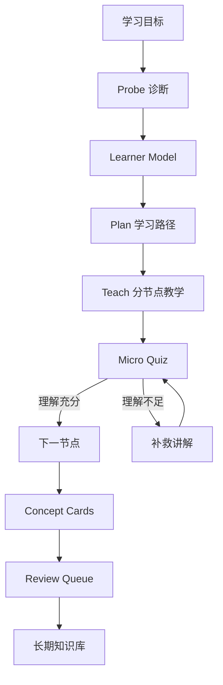
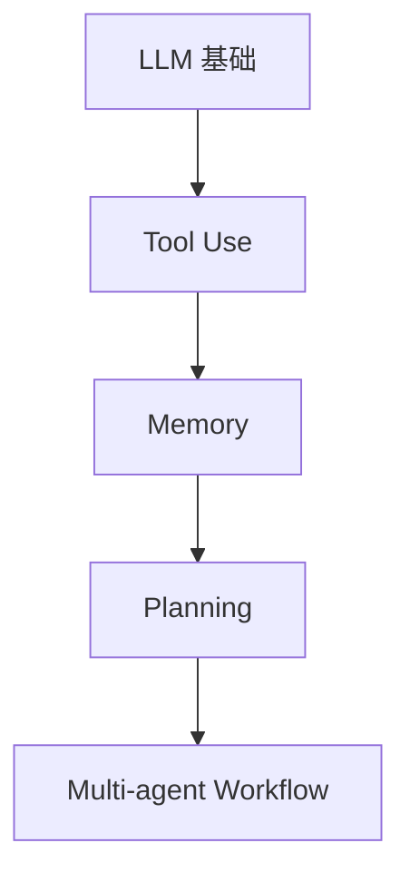

很多人用 AI 学习时，会遇到一个问题：AI 讲得很多，但学完之后没留下结构。

今天问一个问题，明天又开一个新聊天。知识散落在对话里，理解有没有真的建立，也很难判断。

我想要的不是“AI 帮我回答问题”，而是一套完整的学习闭环：

```text
诊断我现在会什么
规划我接下来该学什么
一步一步教我
不断测试我是否真的理解
把过程沉淀成笔记、概念卡和复习队列
```

这就是这套 **AI + Obsidian 自适应学习系统** 要解决的问题。

---

## 一句话解释这个框架

这个框架可以概括为：

> 以 Obsidian 为长期记忆层，以 Markdown 为数据协议，以 AI Agent 为教学引擎的个人学习操作系统。

更简单地说：

```text
AI = 私人教练
Obsidian = 白板 + 笔记库 + 复习箱
Markdown = AI 和 Obsidian 之间的通用格式
插件/脚本 = 把对话写进笔记的机械臂
```

它不是让 AI 直接讲课，而是让 AI 先诊断、再规划、再教学、再追问、再沉淀。

---

## 为什么普通 AI Chat 不够用？

普通 AI Chat 的流程通常是：

```text
我问一个问题 → AI 回答 → 我觉得懂了 → 结束
```

这个流程有几个问题：

1. AI 不知道我的真实基础。
2. AI 经常从错误的难度开始讲。
3. 我容易把“听懂了”误认为“掌握了”。
4. 对话结束后，知识没有自动沉淀。
5. 没有复习机制，过几天就忘了。

所以这个系统把流程改成：

```text
学习目标
→ Probe 诊断
→ Learner Model 学习者模型
→ Plan 学习路径
→ Teach 分节点教学
→ Micro Quiz 小测校准
→ Concept Cards 概念卡
→ Review Queue 复习队列
```

---

## 整体架构



这个图里最重要的是两件事：

第一，AI 不直接讲完整课程，而是先测你的状态。

第二，每次学习都要留下 artifact，也就是可复用的知识资产。

---

## 四层系统设计

这套系统可以拆成四层。

### 1. 界面层：Obsidian

Obsidian 负责展示和承载学习内容。

它适合做这件事，因为它天然支持：

- Markdown
- 双链
- Mermaid 图
- LaTeX 公式
- 文件夹组织
- Dataview 查询
- 插件扩展

在这个框架里，Obsidian 不是 AI，而是学习系统的界面和长期记忆。

---

### 2. 教学层：AI Agent

AI 负责学习过程中的智能决策。

它做这些事情：

- 生成诊断题
- 判断我的答案
- 建立 Known / Shaky / Missing 模型
- 规划学习路径
- 分节点讲解
- 生成小测
- 根据错误进行补救教学

这里的关键不是“AI 知道很多”，而是“AI 会根据我的状态调整教学”。

---

### 3. 记忆层：Markdown 知识库

学习过程会被拆成三类文件。

```text
Learning Sessions/   每次学习会话
Concepts/            长期概念卡
Reviews/             复习队列
```

一次学习会话是过程记录。

概念卡是长期知识。

复习队列是未来重新激活记忆的入口。

---

### 4. 工具层：脚本和插件

工具层负责把 AI 对话写进 Obsidian。

最初可以用 Python 脚本：

```bash
python3 scripts/teach.py "我想学习 AI Agent 架构"
python3 scripts/mdlog.py new "学习主题"
pbpaste | python3 scripts/mdlog.py append ai -
```

进一步可以做成真正的 Obsidian 插件。

插件可以做到：

- 读取当前 active note
- 把剪贴板内容追加到当前 note
- 打开 streaming writer，边输入边写入当前 note
- 创建新的学习会话笔记

---

## 关键模块解释

## Probe：先诊断，不急着讲

学习开始时，系统会先问 5 到 8 个问题。

这些问题不是为了考试，而是为了判断我的前置知识。

例如我要学习 AI Agent，系统可能先问：

- LLM 是什么？
- Tool use 是什么？
- RAG 和 memory 有什么区别？
- Agent planning 是什么？

回答之后，AI 会判断：

```text
Known   已掌握
Shaky   不稳定
Missing 缺失
```

这样后面的教学才是针对我的，而不是照搬教材目录。

---

## Plan：把学习路径画出来

诊断之后，系统会生成一张 Mermaid 图。

比如：



这个图不是为了好看。

它有两个作用：

1. 让我知道接下来要学什么。
2. 逼 AI 明确概念之间的依赖关系。

如果 AI 不能画出路径，它很可能也没有真正规划清楚。

---

## Teach：分节点教学

每个节点都按固定结构讲：

```text
Intuition      直觉解释
Formal         形式定义
Worked Example 完整例子
Pitfall        常见误区
Micro Quiz     小测
Artifact       应该沉淀的笔记
```

这个结构避免 AI 一口气输出一大篇内容。

每次只学一个节点，学完就测。

---

## Micro Quiz：防止“感觉懂了”

用 AI 学习时，一个最大的陷阱是：

> AI 讲得太顺，我以为自己懂了。

所以每个节点后面必须有小测。

如果我答对，就进入下一节点。

如果我答错，AI 不应该继续推进，而应该换一个类比、例子或练习重新讲。

这就是 calibration。

---

## Concept Cards：把对话变成知识资产

学完后，系统会把会话里的重要概念拆成独立笔记。

一张概念卡大概长这样：

```markdown
# Agent Memory

## One sentence
Agent Memory 是让 Agent 在当前上下文之外保存和取回信息的机制。

## Intuition
它像人的工作笔记和长期记忆。

## Formal definition
...

## Example
...

## Common trap
不要把 memory 和 RAG 完全等同。

## Retrieval prompts
- Agent memory 和 RAG 有什么区别？
```

这样一次聊天就变成了可长期复用的知识库。

---

## Review Queue：让知识回来找你

最后，系统会生成复习队列。

```text
24h review
7d review
30d review
```

24 小时后做主动回忆。

7 天后做混合题。

30 天后做迁移应用题。

学习不是“今天懂了”，而是“以后还能想起来，并能用到新问题里”。

---

## 最小可用目录结构

```text
Obsidian-AI-Learning-MVP/
├── Dashboard.md
├── Learning Sessions/
├── Concepts/
├── Reviews/
├── Maps/
├── Prompts/
├── Templates/
├── scripts/
│   ├── teach.py
│   └── mdlog.py
└── .obsidian/plugins/ai-learning-mdlog/
    ├── manifest.json
    ├── main.js
    └── styles.css
```

---

## 如何开始使用

第一步，打开 vault：

```text
/Users/yuajing/Study/Obsidian-AI-Learning-MVP
```

第二步，运行学习会话：

```bash
cd /Users/yuajing/Study/Obsidian-AI-Learning-MVP
python3 scripts/teach.py "我想系统学习 AI Agent 架构"
```

第三步，回答 Probe 题。

第四步，看系统生成的 Mermaid 学习路径。

第五步，按 `learn>` 提示继续回答小测。

第六步，生成概念卡和复习队列：

```text
/concepts
/review
```

---

## 如果使用 Obsidian 插件

启用插件后，可以在 Command Palette 里搜索：

```text
AI Learning MD Log
```

常用命令：

- Create new AI learning session note
- Open streaming writer for active note
- Append clipboard to active note as AI log
- Append selected text as user log
- Read current active note into notice

最常用的是：

```text
Open streaming writer for active note
```

打开后，把 AI 对话粘进去，它会持续写入当前笔记。

---

## 这个系统适合什么场景？

适合：

- 学技术框架
- 学数学概念
- 学论文
- 学 AI Agent / 编程 / 产品设计
- 建立自己的知识库
- 把零散 AI 对话变成长期资产

不适合：

- 只想问一个事实性问题
- 不愿意做小测
- 不愿意复习
- 只想收藏资料但不主动学习

---

## 最重要的使用原则

不要把它当自动笔记工具。

要把它当成学习闭环：

```text
目标 → 诊断 → 规划 → 学习 → 小测 → 沉淀 → 复习
```

如果只保存 AI 回答，用 `mdlog.py` 或插件就够了。

如果真的要学一个主题，用 `teach.py` 或后续完整 agent 流程。

---

## 总结

这套系统的核心不是“让 AI 讲得更好”，而是让 AI 帮你建立一套学习流程。

它让每次学习都有开始、有诊断、有路径、有反馈、有沉淀、有复习。

最后留下的不只是一个聊天记录，而是一套不断增长的个人知识库。

一句话记住：

> AI 负责教练式学习流程，Obsidian 负责长期记忆和复习，Markdown 负责把两者连接起来。
