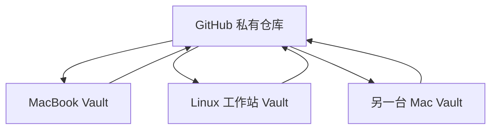

多设备管理最危险的场景，不是某台电脑没有及时同步，而是两台电脑都认为自己拥有“最新版本”。

例如，MacBook 和 Linux 工作站同时修改了：

```text
Projects/agent-framework/Project.md
```

一台把当前节点写成“上下文压缩”，另一台写成“错误恢复”。如果后台工具悄悄选择一边覆盖，学习历史看似完整，项目状态实际上已经分叉。

所以这套系统没有把“同步得越自动越好”当作目标。当前策略是：**GitHub 私有仓库作为唯一共享源，在每次学习的开始和结束建立明确同步边界。**

## 先确定唯一共享源

设计目标的多设备拓扑很简单：



每台设备都有完整的本地 Vault，可以离线阅读和编辑；Git 负责版本历史，私有远端负责设备之间交换变更。

先检查远端是否真的存在：

```bash
git remote -v
```

如果没有任何输出，这份 Vault 目前仍然只有本地版本历史，还不能跨设备同步。此时先创建私有仓库，再在第一台设备绑定并推送：

```bash
git remote add origin <private-repo-url>
git push -u origin main
```

同一个 Vault 不应该再让另一套同步服务同时承担“唯一真相”。如果决定使用 Git，就不要再让 Obsidian Sync、网盘双向同步或其他后台同步工具同时改写这份目录。两套同步引擎不会理解彼此的锁和提交边界，最终只会制造重复文件、删除回滚或难以解释的冲突。

## 哪些内容进入 Git，哪些只留在设备上

判断标准不是“这个文件重不重要”，而是“它是不是所有设备都应该看到的可迁移状态”。

| 内容 | 是否同步 | 原因 |
|---|---:|---|
| `Projects/`、`Knowledge/`、`Notes/`、`Inbox/`、`Reviews/` | 是 | 学习内容与状态 |
| `Templates/`、`Prompts/`、`AGENTS.md` | 是 | 所有设备共享的工作协议 |
| `scripts/`、安全的 Pi 模板与项目内扩展 | 是 | 可复现的系统能力 |
| Obsidian 插件代码与非工作区设置 | 是 | 保持界面与能力一致 |
| `.obsidian/workspace*.json`、缓存和日志 | 否 | 每台设备的窗口与临时状态不同 |
| `.mdlog.json` | 否 | 指向当前设备正在记录的本地笔记 |
| Pi 会话、本机缓存与 `System/local/` | 否 | 不应成为跨设备知识状态 |
| API Key、`.env`、secret 文件 | 否 | 设备私有凭据，绝不进入仓库 |

仓库的 `.gitignore` 已经表达了这条边界。提交前仍应检查：

```bash
git status --short
git diff --cached --name-only
```

如果 staged 列表里出现 `.env`、secret、workspace 或本地会话文件，先停止提交并检查忽略规则。不要通过“先提交再删除”的方式处理密钥；一旦进入 Git 历史，普通删除并不会让它消失。

## 每台设备必须有自己的名字

不同设备最容易安全并发创建的内容，是新的学习会话。系统用时间、设备名和主题生成文件名：

```text
YYYY-MM-DD-HHmm-<device>-<topic>.md
```

每台设备设置一个稳定且不同的 `LEARNING_DEVICE`：

```bash
export LEARNING_DEVICE="macbook"
```

另一台可以使用：

```bash
export LEARNING_DEVICE="linux-home"
```

创建会话后会得到类似文件：

```text
Projects/rust-async/Sessions/
├── 2026-08-29-0930-macbook-future.md
└── 2026-08-29-2110-linux-home-executor.md
```

两台设备各自新增文件时，Git 通常可以直接合并。相反，`Project.md`、`Roadmap.md` 和已有概念文件是共享状态，应尽量保持同一时间只有一台设备写入。

## 一次学习的标准同步节奏

### 开始前：先确认，再拉取

进入 Vault 后先看状态：

```bash
git status --short
# 只有工作区状态符合预期时，才继续拉取
git pull --rebase
python3 scripts/learning.py list-projects
```

如果 `git status --short` 已经有本地改动，不要直接开始另一轮学习。先判断这些改动属于什么：

- 已完成的学习内容：检查后提交，再拉取远端。
- 尚未完成但必须保留的工作：做一个说明清楚的本地 WIP 提交，再拉取。
- 来历不明的改动：停止同步，先查明来源，不要批量覆盖或删除。

显式提交比长期把学习内容藏在 stash 里更容易追踪。这里追求的不是漂亮的 Git 历史，而是每份知识都有可恢复的版本。

### 学习中：一个项目状态只交给一个写入者

学习中可以新增当前设备自己的 Session，但修改共享状态时要更克制：

```text
安全并发：两台设备分别创建不同的 Session
谨慎并发：两台设备修改不同项目的 Project.md
避免并发：两台设备修改同一个 Project.md、Roadmap.md 或 Concept
```

如果确实需要从另一台设备接力，先在设备 A 完成健康检查、提交和推送，再在设备 B 拉取后继续。不要依赖“我大概已经同步了”。

### 结束后：检查、精确提交、推送

一次学习结束后执行：

```bash
python3 scripts/vault_health.py
git status --short
git diff --check
git add Projects/<project-id>/ Knowledge/Concepts/<concept>.md
git diff --cached --stat
git commit -m "learn: update <topic>"
git push
```

`git add` 最好列出本次实际修改的路径，而不是不加判断地收进整个 Vault。提交前的 `--stat` 是最后一次范围核对：本次学习不应该突然带上 workspace、缓存、密钥或另一个无关项目的大批文件。

## 新设备怎样接入

当前 MVP 的一等支持范围是 macOS 和 Linux。新设备接入可以分成六步。

### 1. 准备基础工具

```bash
git --version
python3 --version
pi --version
```

还需要安装 Obsidian，并确保设备能访问私有 Git 仓库。

### 2. 克隆 Vault

```bash
git clone <private-repo-url> obsidian-learning-os
cd obsidian-learning-os
```

不要从旧设备手工复制整个 Obsidian 目录再接 Git。克隆可以明确这台设备从哪个提交开始，也不会把旧设备的 workspace、缓存或 secret 一起带过来。

### 3. 设置设备名

```bash
export LEARNING_DEVICE="linux-home"
```

把变量写入本机 shell 配置时，每台设备使用不同值。设备名只用于标识会话来源，不需要包含用户名、公司名或其他敏感信息。

### 4. 配置本机凭据与 Pi

按照 `System/setup/README.md` 在设备本地设置 `QIHOO_API_KEY`，然后安装仓库中的安全模板：

```bash
bash System/setup/install-pi-config.sh
```

脚本会备份已有 Pi 配置并合并 provider 定义。仓库只保存 `$QIHOO_API_KEY` 这个引用，密钥值留在本机，不通过 Git、聊天记录或 Obsidian 笔记传递。

### 5. 用 Obsidian 打开仓库根目录

启用当前方案需要的社区插件：

```text
Dataview
Templater
AI Learning MD Log
```

窗口布局、最近打开文件和当前 MD Log 目标仍然由新设备自己建立，不需要从旧设备恢复。

### 6. 做接入验收

```bash
python3 scripts/vault_health.py
python3 scripts/learning.py list-projects
pi --list-models
git status --short
```

健康检查应通过，项目列表应能读出，Pi 应能看到预期模型，Git 工作区应没有由安装过程意外产生的知识内容改动。

## 发生 Git 冲突时怎么办

先停止所有自动写入。学习 CLI、`teach.py` 和 `mdlog.py` 本身也会在检测到未解决冲突时拒绝继续创建内容。

第一步只确认冲突范围：

```bash
git status
git diff --name-only --diff-filter=U
```

然后逐个文件处理。原则是保留两边的信息，再决定最终状态，而不是简单选择“ours”或“theirs”。

对于 `Project.md`，重点核对：

```text
progress
current_stage
Current node
Next action
Progress log
```

对于 Concept，重点核对新证据、confidence、误区和 retrieval prompts。对于 Session，通常可以保留成两个独立文件，并补上清晰的设备或主题标识。

完成手工合并后：

```bash
git add <已解决的文件>
git rebase --continue
python3 scripts/vault_health.py
git push
```

如果还存在冲突，健康检查或 Git 状态会继续报告。不要使用 `git push --force` 把另一台设备的学习历史压掉。

## 三种常见故障，怎样预防

### 故障一：两台设备同时改项目进度

预防方式不是给 Markdown 加复杂分布式锁，而是让 `Project.md` 保持单写入者。设备接力前完成一次 push/pull 边界。

### 故障二：本机状态在另一台设备反复变化

通常是 workspace、缓存或 `.mdlog.json` 被错误同步。把它们移回 `.gitignore` 边界，并确认历史提交中没有继续追踪这些文件。

### 故障三：Git 和另一个同步服务互相打架

选择一个唯一共享源。当前方案选择 GitHub 私有仓库，因此其他工具只能做只读备份，不能同时双向改写 Vault。

## 手机和平板目前怎么处理

当前方案明确把 Mac/Linux 作为完整写入端，手机端自动化暂未实现。

如果手机只是临时记录，最稳妥的做法是把内容放到单独的捕获入口，回到电脑后再整理进 `Inbox/`。在没有经过验证的移动端 Git 工作流之前，不建议让手机同时承担项目状态和永久概念的写入。

这个限制不是永久设计，只是当前 MVP 的诚实边界。

## 设备退役时的检查清单

一台设备不再使用前，先确认它没有未同步内容：

```bash
git status --short
git log -1 --oneline
git push
```

随后删除本机凭据、Pi 全局配置中的私有 provider 信息和本地 Vault。远端仓库保留知识内容与版本历史，但不应该依赖退役设备保存任何唯一数据。

## 最终的多设备原则

```text
一个私有 Git 远端，作为唯一共享源。
每台设备一个独立名字、一份本机凭据和一套本地状态。
开始前 pull，结束后 health check、commit、push。
新增 Session 可以并发，共享状态尽量单写入。
有冲突就停止自动化，保留两边内容，绝不 force push。
```

多设备管理真正要保护的不是某个文件，而是学习状态的连续性。同步快一点当然方便，但知道哪一份是最新的、为什么发生了变化、出错后能不能恢复，更重要。
