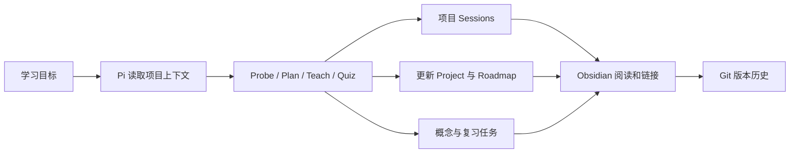
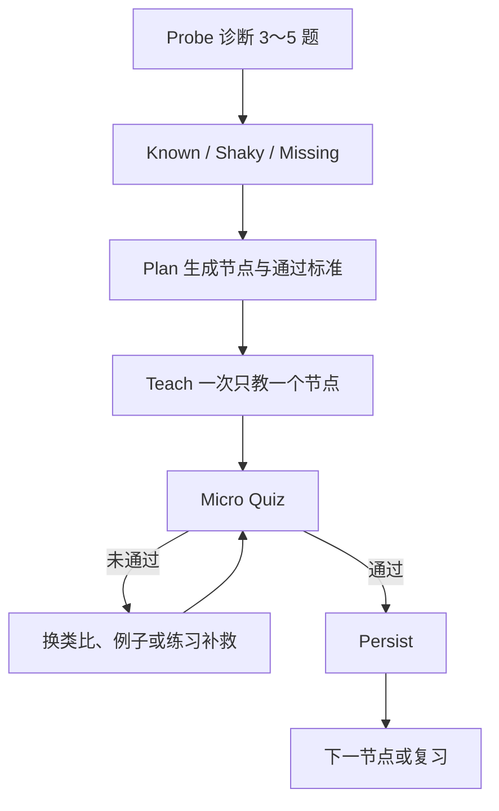

现在，我开始一次学习的动作大致是这样的：

```bash
git status --short
git pull --rebase
python3 scripts/learning.py list-projects
python3 scripts/learning.py new-session agent-framework "Agent Harness 的失败恢复"
```

然后我在 Vault 根目录启动 Pi，说一句：

```text
继续学习 agent-framework
```

Pi 不会马上扔给我一篇长答案。它会先读取项目状态和路线，判断我已经会什么、哪里不稳，再按一个节点完成讲解、小测和沉淀。

上一篇 [用 Obsidian 和 AI 搭建一个自适应学习系统](../obsidian-ai-learning-system/) 讲的是这个想法为什么成立。这一篇只回答一个更实际的问题：**这套系统现在到底由什么组成，又是怎样设置起来的？**

## 先看结果：一次学习会留下什么

一次有效学习结束后，Vault 里不只是多了一篇聊天记录，而是会更新几类不同的文件：

```text
Projects/agent-framework/Project.md
Projects/agent-framework/Roadmap.md
Projects/agent-framework/Sessions/<本次会话>.md
Projects/agent-framework/Reviews/<专项复习>.md
Knowledge/Concepts/<稳定概念>.md
```

它们的职责并不相同：

- `Session` 保存探索、错误和纠正过程。
- `Project.md` 保存项目当前进度，是项目状态的唯一事实源。
- `Roadmap.md` 保存节点依赖和通过标准。
- `Review` 保存 24 小时、7 天和 30 天后的主动回忆任务。
- `Knowledge/Concepts` 只接收已经理解、校准且能跨项目复用的知识。

这个区分很重要。项目保存“我是怎样学会的”，Knowledge 保存“现在有什么值得长期复用”。整段 AI 回答不会因为写进 Obsidian，就自动变成永久知识。

## 四个组件，各自只做一类事情

当前方案可以压缩成四个组件：

```text
Obsidian = 阅读、链接、检索和可视化界面
Pi       = 诊断、规划、教学、测验和整理的 Agent
Markdown = 所有内容之间的稳定数据协议
Git      = 版本历史和多设备同步边界
```

它们组合后的数据流是：



这里没有数据库，也没有把核心数据锁在某个 AI 产品里。即使以后替换 Obsidian、Pi 或模型，Markdown 文件仍然可以被其他编辑器、脚本和 Agent 读取。

## Vault 为什么从“笔记文件夹”变成了“学习操作系统”

当前目录结构是：

```text
Inbox/                         未整理的快速捕获
Projects/<project-id>/         一个独立学习项目
  Project.md                   项目状态唯一事实源
  Roadmap.md                   学习路径和节点依赖
  Sessions/                    每次学习过程
  Sources/                     资料索引和来源笔记
  Reviews/                     该项目的专项复习
Knowledge/Concepts/            可跨项目复用的永久概念
Knowledge/Maps/                跨概念知识地图
Notes/                         尚未形成永久概念的普通笔记
Reviews/                       跨项目复习入口
Templates/                     项目、会话、概念、资料和复习模板
Prompts/                       教学提示词
System/                        新设备与 Pi 配置模板
scripts/                       项目管理、教学记录和健康检查
Dashboard.md                   全局入口
AGENTS.md                      Agent 的协作与安全规则
```

最关键的改动，是把“项目过程”和“共享知识”分开。

例如，学习 Agent Framework 时，诊断答案、失败例子和本次进度都属于 `Projects/agent-framework/`。只有“Tool Calling Protocol”这种经过验证、以后学习其他 Agent 项目仍然有用的概念，才进入 `Knowledge/Concepts/`。

这样既保留了上下文，又避免 Knowledge 变成 AI 摘要仓库。

## Agent 怎样知道下一步该做什么

行为规则写在 Vault 根目录的 `AGENTS.md` 中。继续一个项目时，Agent 按固定顺序读取：

```text
1. Projects/<project-id>/Project.md
2. Projects/<project-id>/Roadmap.md
3. 最近一篇 Sessions/*.md
4. 项目引用且 confidence 较低的概念
```

然后进入同一条教学循环：



每个节点默认控制在约 20～40 分钟。讲解固定包含直觉、正式定义、完整例子、常见误区和小测。答错时停在当前节点，而不是为了“完成课程”继续往下讲。

## Obsidian 这一层怎样设置

当前方案使用三个社区插件：

- `Dataview`：让 `Dashboard.md` 自动聚合活跃项目、最近会话、低 confidence 概念和复习队列。
- `Templater`：为模板补充创建日期等动态字段。
- `AI Learning MD Log`：把当前 Obsidian 笔记变成 AI/终端会话的写入目标。

打开仓库目录作为 Vault 后，在 Obsidian 中启用这些插件即可。Dashboard 的查询直接读取 Markdown frontmatter，例如：

```dataview
TABLE title, progress, current_stage, target_date
FROM "Projects"
WHERE type = "learning-project" AND status = "active"
SORT file.mtime DESC
```

`AI Learning MD Log` 适合需要边聊边记录的场景。它可以创建学习会话、把剪贴板追加为 AI log、把选中文本追加为 user log，也可以向当前 active note 流式写入。

插件负责“写进去”，但不负责判断什么应该成为永久概念。这个判断仍由教学循环和人工校准完成。

## Pi 这一层怎样设置

Pi 在这里是 Agent 运行环境。核心规则来自 `AGENTS.md`，项目内还可以放置 Pi Skill、Extension 和 Package，提供更具体的教学或工具能力。

仓库中的模型模板位于：

```text
System/pi/models.template.json
```

模板只引用环境变量名，不保存密钥。新设备执行：

```bash
bash System/setup/install-pi-config.sh
```

安装脚本会先备份现有 Pi 配置，再合并当前 provider 模板。API Key 由每台设备在本地通过 `QIHOO_API_KEY` 提供，不写进 Vault，也不通过 Git 同步。

安装后可以检查模型列表和 Vault 状态：

```bash
pi --list-models
python3 scripts/vault_health.py
```

项目里的 `.pi/skills/pi-learning-coach/` 和 `.pi/extensions/pi-learning-demo.ts` 是扩展示例。前者把 Pi 相关学习固定为 Probe → Plan → Teach → Quiz → Persist，后者演示如何注册命令和模型可调用工具。它们是可替换的能力层，不是知识数据本身。

## 脚本和模板怎样减少机械操作

创建一个标准项目时，不需要手工搭五个目录：

```bash
python3 scripts/learning.py new-project rust-async "Rust 异步编程" \
  --goal "能够构建可靠的异步服务"
```

脚本会生成：

```text
Projects/rust-async/
├── Project.md
├── Roadmap.md
├── Sessions/
├── Sources/
└── Reviews/
```

创建会话时，文件名自动带上时间、设备名和主题：

```bash
python3 scripts/learning.py new-session rust-async "Future 与执行器"
```

除此之外还有三类工具：

```text
scripts/teach.py         连续执行自适应教学流程
scripts/mdlog.py         把 AI、用户或命令输出追加到当前会话
scripts/vault_health.py  检查目录、项目、双链、冲突和潜在密钥
```

在任何自动写入之前，学习脚本都会检查 Git 是否存在未解决冲突。如果有冲突，就停止创建新内容。这个限制看起来有点保守，但对一个长期、多设备使用的知识库来说，停止写入比静默覆盖更可靠。

## 从零搭起来的最短路径

如果在一台新电脑上恢复这套系统，最短步骤是：

```bash
# 1. 克隆私有仓库并进入 Vault
git clone <private-repo-url> obsidian-learning-os
cd obsidian-learning-os

# 2. 按 System/setup/README.md 配置本机环境变量后，安装 Pi 模型模板
bash System/setup/install-pi-config.sh

# 3. 检查目录、配置和运行环境
python3 scripts/vault_health.py

# 4. 查看项目
python3 scripts/learning.py list-projects
```

如果这是准备作为远端源的第一台设备，而不是从现有远端克隆，还要先检查并绑定私有仓库：

```bash
git remote -v
git remote add origin <private-repo-url>
git push -u origin main
```

`git remote -v` 没有输出时，说明多设备方案还停留在本地，没有真正建立共享源。随后用 Obsidian 打开仓库根目录，启用推荐插件；再从 Vault 根目录启动 Pi。到这里，Obsidian、Pi、Markdown 和 Git 才真正形成一个闭环。

## 这套方案目前刻意没有做什么

当前版本首先解决“可靠地学、可靠地留下、可靠地同步”，因此暂时没有加入：

- 后台自动同步；
- 手机端自动化；
- 向量数据库和 RAG；
- 云数据库；
- 自动下载全部资料；
- 多 Agent 同时改写同一份知识。

这些能力不是不能做，而是会引入新的状态源和冲突面。在基本的项目、概念、复习和多设备流程稳定之前，增加更多自动化只会让系统更难解释。

## 最后，把设置原则压缩成五句话

```text
项目保存学习过程，Knowledge 保存稳定知识。
Project.md 是项目状态的唯一事实源。
Agent 先诊断，再规划、教学、测验和沉淀。
密钥与设备状态留在本机，Markdown 内容进入 Git。
任何自动化都不能绕过冲突检查和人工校准。
```

这就是当前方案的完整骨架。下一篇 [Obsidian Learning OS 多设备管理：同步、冲突与新设备接入](../obsidian-learning-os-multi-device/)，会继续解释这套 Vault 怎样在多台 Mac/Linux 设备之间安全流动。
